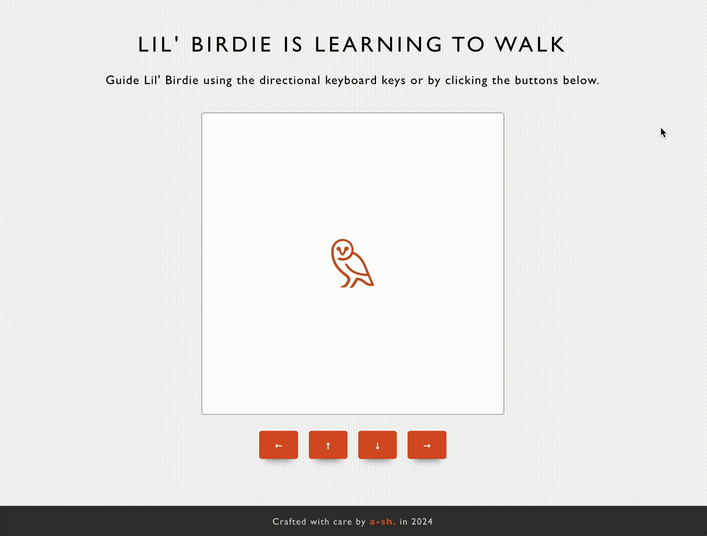

# 🐥 Lil' Birdie Controller

## How to run

There is a `.nvmrc` included that should load up the node version.

This project uses `pnpm` as the package manager. Please install `pnpm` first, and the easiest way is via `homebrew` - [pnpm installation](https://pnpm.io/installation#using-homebrew).

After installing `pnpm`, install the dependencies first by running:

```bash
pnpm install
```

Then, to run the app:

```bash
pnpm dev
```

View the development on the browser:

```
http://localhost:5173/react_lil-bird_controller/.
```

To run tests:

```bash
pnpm test
```

## Preview



## Deployed Link

> https://a-sh-dev.github.io/react_lil-bird_controller/

## Assumptions

- For the user experience and a Bellroy look, I provided a context of _"Lil' Birdie is Learning to Walk"_ little game rather than just a robot simulator.
- Inspired by a snake game, this little game has been simplified and can be extended for additional features.
- "Cardinal directions" are limited to only the x and y-axis, and the diagonal direction is not covered.
- The <s>robot</s> Birdie can be controlled using the keyboard's directional keys and supplied buttons for mobile users.

## Design decisions

- I used `TypeScript` to improve the code quality by writing more reliable and especially maintainable code. The benefit of static typing to `JavaScript` will help prevent errors in development.
- To maintain code consistency for collaborative work, I added basic `es-lint`, `prettier`, and VSCode settings (`.vscode`).
- I added a simple `GitHub Actions CI/CD` to check tests for newly pushed PRs & automated deployment workflow.

## Tech stack

- `React-ts` through `Vite`, as recommended by React,
- `Vitest` and `Testing-library` for unit testing,
- `styled-components` to integrate dynamic styling.
- `GitHub Actions` for deployment and `CI/CD`.

## Trade-offs

### Testing

- Separated the movement logic into its own utility to make it more testable and reusable.
- Ideally, the movement logic with the states can be separated into its own custom hook so that behaviour tests can be implemented. For simplicity, I only test the movement logic.

### Design

- For simplicity, I used a shared styles object throughout the styling instead of relying on CSS variables. Ideally, a theme and theme provider would be set up for better consistency and maintainability.

### User experience that can be improved

- The buttons can be disabled when the bird reaches the board boundary. This can be done with the controllers inheriting the bird's position to check if it's at the maximum boundary of the board.
- I would add simple directional chevrons to indicate the Birdie's movement direction, especially when moving up and down. These should appear around the Birdie when the keyboard keys are pressed or buttons are hovered over.

---

<sub>This React-ts project is bootstrapped with [`Vite`](https://vitejs.dev). Built with `Node v20.11.1`, packaged with `pnpm`.</sub>

---

<sub>**Crafted with care ❤ (within a very limited time) by a-sh. in 2024**</sub>
