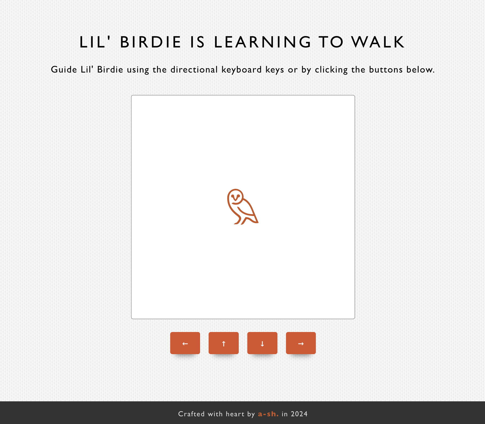

# 🐥 Lil' Birdie Controller

## How to run

There is a `.nvmrc` included that should load up the node version.

This project uses `pnpm` as the package manager. Please install `pnpm` first, and the easiest way is via `homebrew` - [pnpm installation](https://pnpm.io/installation#using-homebrew).

After installing `pnpm`, install the dependencies first by running:

```bash
pnpm install
```

Then, to run the app:

```bash
pnpm dev
```

View the development on the browser: `http://localhost:5173/`.

To run tests:

```bash
pnpm test
```

## Preview



## Assumptions

- For the user experience and a Bellroy look, I gave a context of "Lil' Birdie is Learning to Walk" little game as opposed to just a robot simulator.
- Inspired by a snake game, this little game has been simplified and can be extended for additional features.
- "Cardinal directions" are limited to only the x and y-axis, and the diagonal direction is not covered.
- The <s>robot</s> birdie can be controlled using the keyboard's directional keys and supplied buttons for mobile users.      

## Design decisions

- I used `TypeScript` to improve the code quality by writing more reliable and especially maintainable code. The benefit of static typing to `JavaScript` will help prevent errors in development. 
- To maintain code consistency for collaborative work, I added basic `es-lint`, `prettier`, and VSCode settings (`.vscode`).
- I added a simple `CI/CD` to check tests for newly pushed PRs.

## Tech stack

- `React-ts` through `Vite`, as recommended by React,
- `Vitest` and `Testing-library` for unit testing,
- `styled-components` to integrate dynamic styling.

## Trade-offs

### Testing

- I regret not being able to add behavioral tests through user events due to an incompatibility between `Vitest` and `styled-components`, which I was not aware of. I would have chosen a different `CSS-in-JS` framework that may work better for testing.
  - In a realistic scenario, ideally, I wouldn't test styles, such as snapshot testing. However, since this game heavily uses CSS grid and styling for moving the birdie, it might be feasible to assert the birdie's grid column and row position based on user interaction.
  - Visual testing can also be done through `Storybook`.

### Design

- For simplicity, I only used a shared styles object throughout the styling instead of relying on CSS variables. Ideally, a theme and theme provider would be set up for better consistency and maintainability.

### User experience that can be improved

- For simplicity, I didn't add the disability buttons when the user reached the board boundary.
- If I had more time, I would add simple directional chevrons that appear around the Birdie when the keyboard keys are pressed or buttons have hovered.

---

<sub>This React-ts project is bootstrapped with [`Vite`](https://vitejs.dev). Built with `Node v20.11.1`, packaged with `pnpm`.</sub>

---

<sub>**Crafted with care ❤ (within a very limited time) by a-sh. in 2024**</sub>
